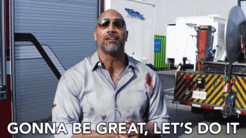

# Module 3 Project

## Project Summary

Congratulations! You've made it through another _intense_ module, and now you're ready to do all kinds of classification!

All that remains for Module 3 is to complete the project!

## The Project

The main goal of this project is to create a classification model. 

For this project you'll have your choice of dataset (see below). Each comes with its own advantages and disadvantages, and, of course its own associated business problem and stakeholders.

We'll be deciding teams based on the data you'd like to work with, so please read through the descriptions of the options and pick your favorite, then we'll help divide everyone in teams of 2-3. We are looking for teams we think will work well together and who haven't worked together much before, so we reserve the right to reassign teams - aka don't pick a dataset just to try to work with someone, pick the data you think you'll enjoy working on!

You should let us know your preferred first and second choices from the options below by **end-of-day on Thursday, April 9** - we will decide the groups and let you know who you're working with first thing on **Friday, April 10**.

### The Data

**Option 1: [Tanzanian Water Well Data](https://www.drivendata.org/competitions/7/pump-it-up-data-mining-the-water-table/page/23/)** (*active competition!*)

Tanzania, as a developing country, struggles with providing clean water to its population of over 57 million people. There are many waterpoints already established in the country, but some are in need of repair while others have failed altogether.

Build a classifier to predict the condition of a water well, using information about the pump, when it was installed, etc. Note that this is a **ternary** classification problem.

**Option 2: [Customer Churn Data](https://www.kaggle.com/becksddf/churn-in-telecoms-dataset)**

It's common enough that customers move from one telecommunications company to another to take advantage of the best deals, and thus telecommunications companies want to predict whether a customer will 'churn' - in other words, these companies are asking whether they are likely to lose money on a customer that does not stick around very long. 

Build a classifier to predict whether a customer will ("soon") stop doing business with a telecommunications company, given information on the customers, their phone calls and charges, etc. Note that this is a **binary** classification problem.

**Option 3: [Chicago Car Crash Data](https://data.cityofchicago.org/Transportation/Traffic-Crashes-Crashes/85ca-t3if)**

Note that this dataset also links to [Chicago Vehicle Data](https://data.cityofchicago.org/Transportation/Traffic-Crashes-Vehicles/68nd-jvt3) and to [Chicago Driver/Passenger Data](https://data.cityofchicago.org/Transportation/Traffic-Crashes-People/u6pd-qa9d).

Any major city needs to be aware of traffic accident data, to find out if there are interesting patterns or trends which may point to a problem that could be fixed - thus potentially saving lives.

Build a classifier to predict the primary contributory cause of a car accident, given information about the car, the people in the car, the road conditions etc.  Note that there is a **multi-class** classification problem. You will almost certainly want to bin, trim or otherwise limit the number of target categories on which you ultimately predict - you'll see that some primary contributory causes have very few samples.

**Option 4: Find your own data to classify**

If you'd prefer to find your own dataset upon which to build a classification model, you can present your dataset and your expectations for your project no later than **end-of-day on Thursday, April 9**. Note that there won't be a lot of time to find the data and verify it, but we'd like to give you the option to do a different project if you'd prefer!

## Deliverables

1. A public GitHub repository

2. A user-focused README file that explains your process, methodology and findings

    - Take the time to make sure that you craft your story well, and clearly explain your process and findings in a way that clearly shows both your technical expertise and your ability to communicate your results.
    - Your README should include:

        - An explanation of the data source(s) and how others could obtain the data
        - A summary of the business problem you are trying to solve, and the target audience of the project
        - An explanation of your metric, and why you chose to use that metric 
        - Key takeaways from your model (aka your results, but interpreted for a non-technical audience)
        - A few next steps if you had more time (i.e. one more week)

3. A standalone `data` folder that stores all relevant raw and processed data files

    - Be sure to include in your documentation (potentially in the README or in markdown cells of a Jupyter Notebook) both how the data was obtained and how it was cleaned, in such a way that others could easily reproduce your work.
    - Large data files can be labeled in the `.gitignore` file to avoid having them accidentally live on your GitHub, but be sure to explain to potential users of your data how they can obtain the data used for the project. 
    
        - Extra credit: if your data is too large to upload, include a representative sample of your data that can be used to run all your code 

4. At least one polished Jupyter Notebook file, conveying your EDA, visualizations, and models. 

    - The very beginning of each notebook should describe the purpose and structure of that notebook.

       - This is helpful for your future self and any of your colleagues/potential users that need to view your notebook. Without this context, you’re implicitly asking your peers to invest a lot of energy figuring out what you're doing and where you're doing it.
    
    - Meaningful data visualizations, with corresponding interpretations, should be well-labeled with axes labels, titles, etc.
    - Custom functions and classes should be imported from Python modules, not created directly in the notebook.
        
        - All functions should have docstrings that act as professional-quality documentation.

    - Your notebooks should contain a clear record of your process and methodology for exploring and preprocessing your data, building and tuning a model, and interpreting your results. As you improve your model, be sure to provide clear comparisons to your baseline. 
    - Code should be well-organized and thoroughly commented.
    - Notebooks should be written to technical audiences with a way to both understand your approach and reproduce your results. The target audience for this deliverable is other data scientists looking to validate your findings.  

5. A non-technical "Executive Summary" presentation (preferably provided as a PDF) that explains your project and results

    - Your presentation should take no more than 10 minutes, should include:

       - A high-level overview of your methodology
       - Your results, and your interpretation of those results
       - Any real-world recommendations you would like to make based on your findings (ask yourself--why should the executive team care about what you found? How can your findings help the company/stakeholder?)
    
    - The slides should use visualizations whenever possible, and avoid walls of text
    - Avoid technical jargon and explain results in a clear, actionable way for non-technical audiences

## The Process

If you'd like to follow a CRISP-DM process, your project week would probably look like the following:

### 1. Business Understanding

Start by reading this document, and making sure that you understand the questions being asked. In order to narrow your focus, you will likely want to make some design choices about your specific audience. Do you want to emphasize affordability, investment, or something else? This framing will help you choose which stakeholder claims to address.

Three things to be sure you establish during this phase are:

1. **Objectives:** what questions are you trying to answer, and for whom?
2. **Project plan:** you may want to establish more formal project management practices, such as daily stand-ups or using a Trello board, to plan the time you have remaining. Regardless you should determine the division of labor, communication expectations, and timeline.
3. **Success criteria:** what does a successful project look like? How will you know when you have achieved it?

### 2. Data Understanding

Write a script to download the data (or instructions for future users on how to manually download it), and explore it. Do you understand what the columns mean? How do the data tables relate to each other? How will you select the subset of relevant data? What kind of data cleaning is required?

It may be useful to generate visualizations of the data during this phase.

### 3. Data Preparation

Perform any necessary data cleaning. Be sure to document any data that you choose to drop or otherwise exclude. This is also the phase to consider any feature scaling, encoding or engineering required to feed the data into a classification model. This is something you'll likely return to, tweak, and play around with throughout the process.

### 4. Modeling

The focus this time is on classification. Good classification is a matter of the model generalizing well. Steps we can take to assure good generalization include: testing the model on unseen data, cross-validation, and regularization. What sort of model should you build? A diverse portfolio is probably best. You are encouraged to try any or all of the classification models we've explored.

### 5. Evaluation

Recall that there are many different metrics we might use for evaluating a classification model. Accuracy is intuitive, but can be misleading, especially if you have class imbalances in your target. Depending on your problem definition and target audience, it might be more important to minimize false positives or false negatives, and thus a more appropriate metric to focus on might be precision or recall. Be sure to explain your choice, and to evaluate your models consistently.

### 6. Deployment

In this case, your "deployment" comes in the form of the deliverables listed above. Make sure you can answer the following questions about your process:

 - "How did you pick the question(s) that you did?"
 - "Why are these questions important from a business perspective?"
 - "How did you decide on the data cleaning options you performed?"
 - "Why did you choose a given method, encoding technique or model?"
 - "What did you learn from each of your visualizations?"
 - "Why did you pick those features as variables?"
 - "How would you interpret the results?"
 - "How confident are you in the predictive quality of the results?"
 - "What are some of the things that could cause the results to be wrong?"
